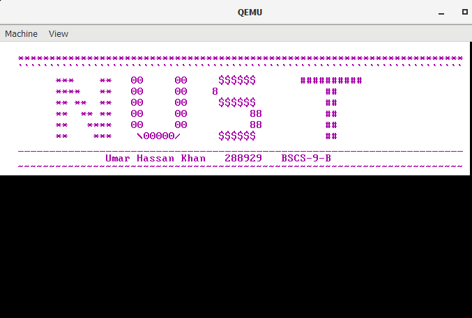

# 64 bit OS kernel
Basic implementation of 64bit OS kernel for learning purpose  
Reference: <https://github.com/davidcallanan/os-series>

## Tools Required
VsCode, Docker, Qemu

### To Run

* To build docker image, run this command in powershell **"docker build buildenv -t myos-buildenv"**
* To run the docker image aka virtual environment, run this command in powershell **"docker run --rm -it -v "${pwd}:/root/env" myos-buildenv"**  
* To build OS iso file, run this command in virtual environment **"make build-x86_64"**
* Finally, exit the virtual envirnoment, and run this command to emulate OS in qemu emulator **"qemu-system-x86_64.exe -L "C:\Program Files\qemu" -cdrom dist/x86_64/kernel.iso"**

### Final output image

